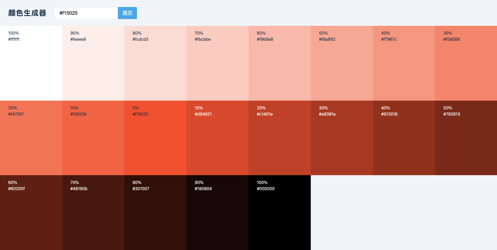

# React && Redux 练习
### Color Generator 颜色选择器

##### 运行手脚架
安装配置
```shell script
yarn install
```
运行项目
```shell script
yarn start
```

##### 使用库
- [value.js](https://www.npmjs.com/package/values.js)
